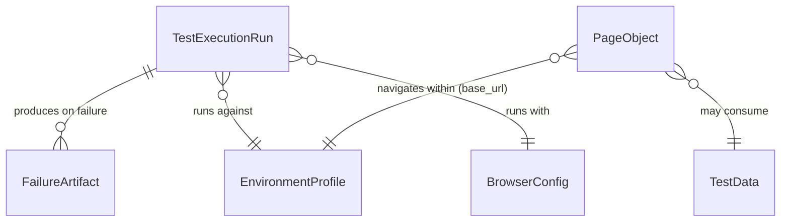

# Phase 1 Data Model: Reusable UI Automation Framework

**Feature**: [spec.md](./spec.md) | **Plan**: [plan.md](./plan.md)

This framework has no persistent application database; "entities" here are
the in-memory/configuration/file-system concepts the framework core
manipulates. Each maps to the Key Entities section of [spec.md](./spec.md).

## EnvironmentProfile

Represents one named deployment target (DEV, TEST, STAGE, PROD).

| Field | Type | Notes |
|---|---|---|
| `name` | `str` | One of `DEV`, `TEST`, `STAGE`, `PROD` (case-insensitive lookup); validated against a fixed allow-list — unknown names raise `ConfigurationError` |
| `base_url` | `str` (URL) | Environment-specific base URL; never hardcoded, sourced from an app-specific env var prefix (e.g. `INTERNET_HEROKUAPP_URL`, `DEMO_PLAYWRIGHT_BASE_URL`) resolved by that app's own fixture — empty for the generic, application-agnostic `settings.environment` profile |
| `default_timeout_ms` | `int` | Optional override for Playwright default action/navigation timeout for that environment |
| `extra_settings` | `dict[str, str]` | Optional environment-specific key/value overrides (e.g., feature flags) |

**Validation rules**:
- `name` MUST match a supported environment; unsupported value fails fast at
  startup with the offending value named in the error (FR-004, edge case).
- `base_url` MUST be present and non-empty whenever a prefix is resolved
  (i.e., for every application-specific profile); missing value fails fast
  (FR-014). The generic, application-agnostic `settings.environment` profile
  resolves no prefix and leaves `base_url` empty.

**Relationships**: Selected once per test run; injected into fixtures/Page
Objects via the settings loader. Independent of `BrowserConfig`.

---

## BrowserConfig

Represents the selected browser engine and execution mode for a run.

| Field | Type | Notes |
|---|---|---|
| `engine` | `Literal["chromium", "firefox", "webkit"]` | Selected via `--browser` CLI flag or `BROWSER` env var; default `chromium` |
| `headless` | `bool` | Default `True`; `--headed` flag or `HEADLESS=false` env var overrides |
| `parallel_workers` | `int \| "auto"` | Passed to `pytest-xdist` `-n` option |

**Validation rules**: `engine` MUST be one of the three supported values;
unsupported value fails fast (edge case in spec.md).

**Relationships**: Orthogonal to `EnvironmentProfile` — any browser can run
against any environment.

---

## TestExecutionRun

Represents one invocation of the suite (one `pytest` session).

| Field | Type | Notes |
|---|---|---|
| `run_timestamp` | `str` | Captured once at session start, formatted `DD-MM-YY-HH-MM-SS` |
| `output_dir` | `Path` | `output/<run_timestamp>/` — created at session start |
| `logs_dir` | `Path` | `output/<run_timestamp>/logs/` |
| `screenshots_dir` | `Path` | `output/<run_timestamp>/screenshots/` |
| `videos_dir` | `Path` | `output/<run_timestamp>/videos/` |
| `report_dir` | `Path` | `output/<run_timestamp>/html-report/` |
| `environment` | `EnvironmentProfile` | The profile active for this run |
| `browser` | `BrowserConfig` | The browser config active for this run |

**Lifecycle**: Created by a session-scoped autouse fixture before any test
runs; every artifact produced during the run (logs, reports, failure
artifacts) is written under this run's `output_dir`. Never mutated after
creation (one run = one immutable output tree).

**Relationships**: Owns zero or more `FailureArtifact` records (one set per
failed test).

---

## FailureArtifact

Represents the diagnostic files captured for a single failed test.

| Field | Type | Notes |
|---|---|---|
| `test_name` | `str` | Sanitized pytest node id (slashes/colons replaced) |
| `browser` | `str` | From `BrowserConfig.engine` |
| `environment` | `str` | From `EnvironmentProfile.name` |
| `timestamp` | `str` | Capture moment, `DD-MM-YY-HH-MM-SS` |
| `screenshot_path` | `Path` | `<screenshots_dir>/<test_name>__<browser>__<environment>__<timestamp>.png` |
| `video_path` | `Path \| None` | `<videos_dir>/<test_name>__<browser>__<environment>__<timestamp>.webm`; `None` if Playwright could not produce one |
| `console_log_path` | `Path \| None` | `<logs_dir>/<test_name>__<browser>__<environment>__<timestamp>.console.log`; `None` when the engine provides no console events (documented WebKit edge case) |
| `exception_summary` | `str` | Short exception type + message, also written into the structured log |

**Validation rules**: Filenames MUST always include all four naming
components (FR-010); a missing video/console log is recorded as `None` and
logged as "unavailable," never silently omitted without explanation.

**Relationships**: Belongs to exactly one `TestExecutionRun`; produced only
on test failure (never on pass/skip).

---

## PageObject (design contract, not a runtime data record)

Represents one UI page or reusable component.

| Field | Type | Notes |
|---|---|---|
| `page` | `playwright.sync_api.Page` | Injected via constructor from the active fixture |
| Business methods | callables | e.g., `login(username, password) -> None`, `is_error_message_visible() -> bool` |

**Rules**: MUST extend `framework_core.pages.base_page.BasePage`. MUST NOT
expose raw Playwright locators as part of its public interface. MUST NOT
import anything from `apps/` (siblings) or from `framework_core` internals
beyond `BasePage`/shared utils.

**Relationships**: One or more Page Objects compose a `tests/<app>/test_scenarios.py`
test; each Page Object belongs to exactly one `apps/<app_name>/` package.

---

## TestData

Represents application-specific, non-secret input values (e.g., sample form
values) used by tests.

| Field | Type | Notes |
|---|---|---|
| `key` | `str` | Logical name, e.g., `valid_username` |
| `value` | `str \| dict \| list` | The actual test input; MUST NOT be a real secret |

**Rules**: Lives under `apps/<app_name>/test_data/`; secrets (passwords,
tokens) are never stored here — only referenced indirectly via environment
variable names resolved at runtime through the settings loader.

**Relationships**: Consumed by tests and/or Page Objects for a specific
application; independent of `EnvironmentProfile` (test data is
environment-agnostic unless a test explicitly parameterizes on environment).

---

## Entity Relationship Summary

